# Ya Tasks

## **Homework 1** Created by goliksim on 15.06.2023

<details>
<summary><b>Посмотреть описание</b> </summary>

Привет! <br/>
Вообще хочу сказать, что я не очень опытен в разработке. Имеется всего 1 соло проектик.

- Проект построен на StateFul / StateLess виджетах с прокидыванием переменных, также поэкспериментировал с InheritedWidgets.
- Навигация самая элементарная (push, pop), но с прокидыванием результата работы редактора.
- Для аппбара использовал визжет SliverAppBar, сделал для него небольшую анимашку с прозрачностью.
- Ячейки с тасками построены через SliverList.
- Форматирование кода выполнил через Dart format.
- Оба экрана сверстаны.
- Новые таски добавляются.
- Таски удаляются обоими способами.
- Таски выполняются и скрываются, подсчет выполненных тасков рабочий.
- Таски редактируются.
- Важность ставиться, меняется и отображается.
- Дата дедлайна выбирается, отключается и отображается (уведомлений нет).
- Свайпы рабочие
- Реализовано сохранение в Shared-Preferences(Подобие persistance), а также пишу логи в локальное хранилище.
- Поработал над хранением темы приложения

| Темная тема                            | Редактор                                       | Менюшка                                        |
| -------------------------------------- | ---------------------------------------------- | ---------------------------------------------- |
| 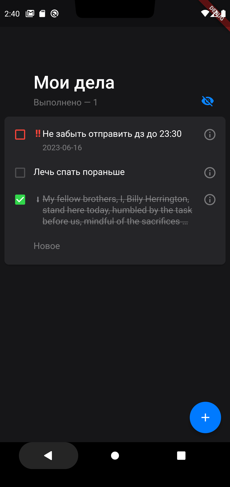 | 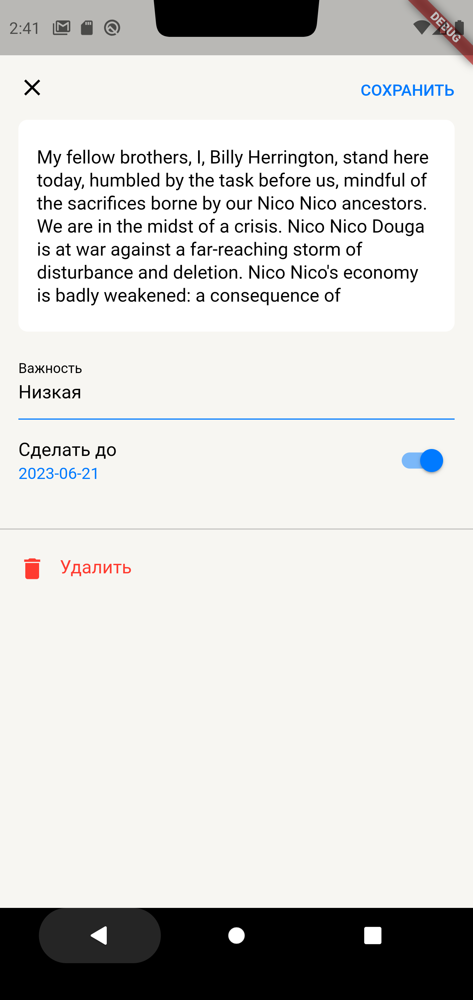 | 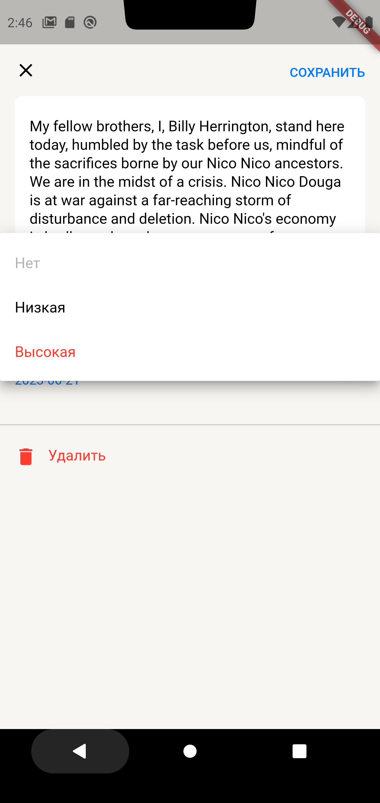 |

### Для справки

---

При подходе к проектированию пытался заложить зачатки чистой архитектуры Роберта Мартина (построение приложения в виде набора независимых слоёв).  
В качестве решения для управления состоянием приложения (State Managment) хотел выбрать BLOC, но пока до него не дошел. 

</details>

## **Homework 2** Created by goliksim on 24.06.2023

<details>
<summary><b>Посмотреть описание</b> </summary>

<br/>

**APK** -> https://drive.google.com/file/d/1Mki9lmu15i3C2CkzLjOkisNC1vTDFJ2D/view?usp=drive_link

**Список изменений:**

- Добавил ссылку на apk в README
- Предупреждений `flutter lints` не выдает.
- Постарался все отформатировать.
- Полностью переписан стейтменеджмент, теперь это `bloc`.
- В коде два блока с taskList'ом и окном редактирования. Bloc to bloc коммуникации через стримы нет, но друг с другом я их связал.
- Кое-как реализовал работу с бекэндом. На данный момент при запуске приложения смотриться revision версия локального хранилища и бекенда. Где выше версия, то и гружу. Все действия сохраняю автоматически и там, и там. 
- Персистентность уже была, но немного модифицировалась под связь с беком. Использую `shared_preferences`.
- Исправлены мелкие баги
- Добавлена `интернализация`.

| <pre>Английский язык 1</pre>                   | <pre>Английский язык 2</pre>                   | <pre>Пруфы с бэкенда</pre>                                 |
| ---------------------------------------------- | ---------------------------------------------- | ---------------------------------------------------------- |
| 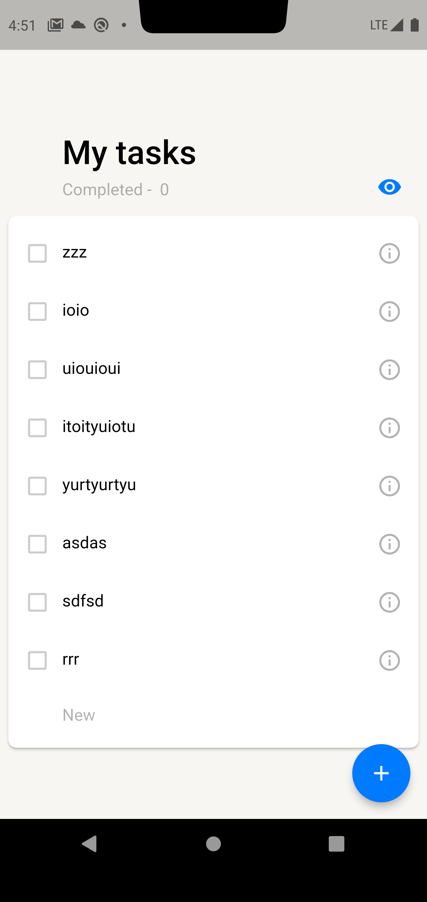 | 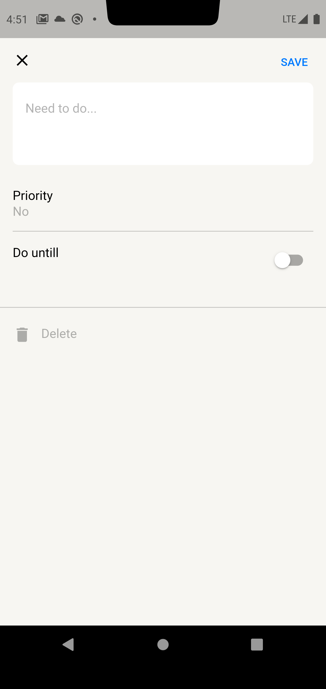 |  |

</details>

## **Homework 3** Created by goliksim on 06.07.2023

<details>
<summary><b>Посмотреть описание</b> </summary>

<br/>

**APK** -> https://drive.google.com/file/d/17t50uBCNJJ3f57fKEtuUbwXU6hjc1Jos/view?usp=sharing

**Список изменений:**

- Работа с данными теперь происходит в репозитории `repository.dart`.
- При запуске приложения все также смотрит на revision версию локального хранилища и бекенда. Где выше версия, то и гружу. Все действия сохраняю автоматически и там, и там. 
- Исправлены мелкие баги.
- Навигация переписана на `Navigator 2.0`.
- Реализована поддержка `DeepLink` как при **горячем**, там и при **холодном** запуске. Поддерживаются следующие URI:
- - ya://todolist.com
- - ya://todolist.com/task
- - ya://todolist.com/task/<uuid> (если uuid не найдена, то страница перейдет в режим новой таски).
- Для темы был добавлен `Theme.extesion`. Теперь нейминг цветов такой же как и в figma.
- Реализовал `--dart-define`  для приватного хранения токена, но отключил, так как неудобно дебажить.

**Работа deeplink:**//

```cmd
PS C:\Users\golev\source\repos\MobileApp\Yandex\NDA\YaFlutter\my_app\ya_todolist> 
adb shell am start -W -a android.intent.action.VIEW -d ya://todolist.com/
Starting: Intent { act=android.intent.action.VIEW dat=ya://todolist.com/ }      
Status: ok
LaunchState: UNKNOWN (0)
Activity: com.goliksim.yatodo.ya_todolist/.MainActivity
TotalTime: 0
WaitTime: 3
Complete
```

<center>
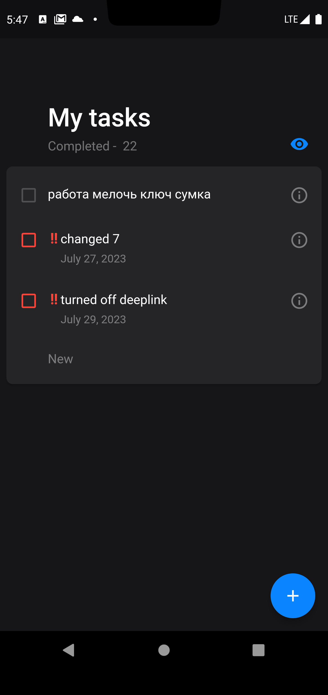
</center>

```cmd
PS C:\Users\golev\source\repos\MobileApp\Yandex\NDA\YaFlutter\my_app\ya_todolist> 
adb shell am start -W -a android.intent.action.VIEW -d ya://todolist.com/task
Starting: Intent { act=android.intent.action.VIEW dat=ya://todolist.com/task }    
Status: ok
LaunchState: UNKNOWN (0)
Activity: com.goliksim.yatodo.ya_todolist/.MainActivity
TotalTime: 0
WaitTime: 9
Complete
```

<center>
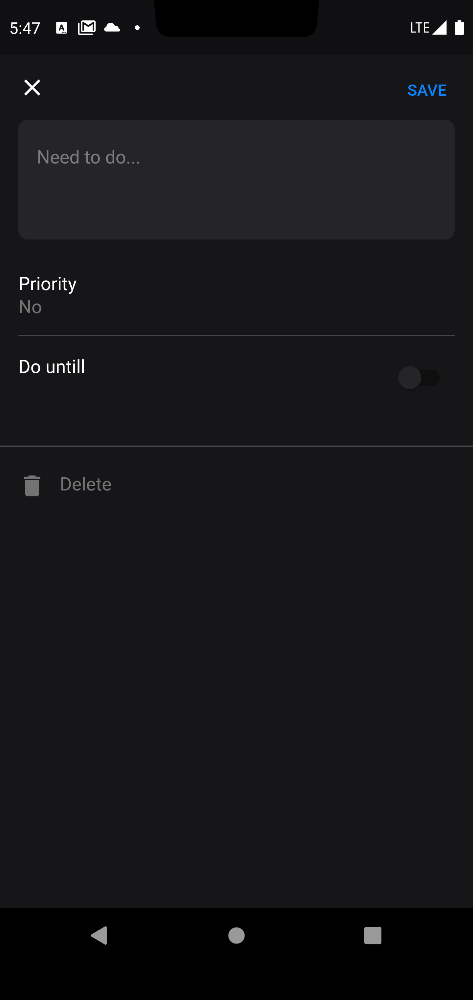
</center>

`Работа на холодную с uuid`

```cmd
PS C:\Users\golev\source\repos\MobileApp\Yandex\NDA\YaFlutter\my_app\ya_todolist> 
adb shell am start -W -a android.intent.action.VIEW -d ya://todolist.com/task/a943fbf7-c1e6-4efd-a9dd-796a441c89dd
Starting: Intent { act=android.intent.action.VIEW dat=ya://todolist.com/task/a943fbf7-c1e6-4efd-a9dd-796a441c89dd }
Status: ok
LaunchState: COLD
Activity: com.goliksim.yatodo.ya_todolist/.MainActivity
TotalTime: 3821
WaitTime: 3822
Complete
```

<center>
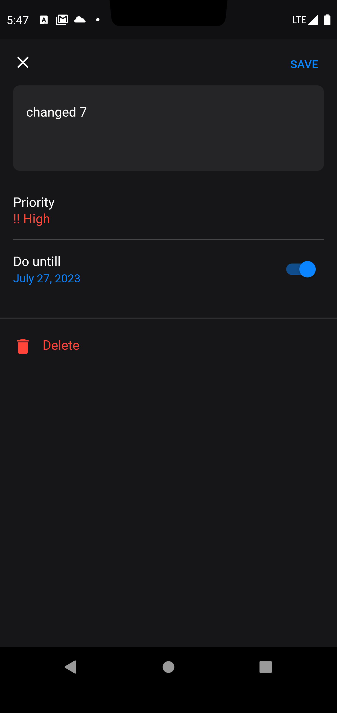
</center>

</details>

## **Homework 3.2** Created by goliksim on 12.07.2023

<details>
<summary><b>Посмотреть описание</b> </summary>
<br/>

- Добавлены и выполняются `интеграционные` и `widget` **тесты**.
- Мигрировал с `shared_preferences` на **`HIVE`**
- Переписана система синхронизации данных **backend/locale**. Теперь схема выглядит следующим образом: 
  1. *грузим данные из облака и локалки*
  2. *далее только, если ревизии разные*
  3. *создаем мапу по локальному хранилищу*
  4. *добавляем таски, которых нет в мапе*
  5. *обновляем таски, которые есть, если они обновлены позднее*
  6. *удаляем таски из локалки, если их нет в беки или они удалены позднее последнего обновления бека*

</details>

## **Homework 4** Created by goliksim on 17.07.2023

<details>
<summary><b>Посмотреть описание</b> </summary>
<br/>

**APK** -> https://drive.google.com/file/d/12el1nGLx8Rf4K4C3vtQ92mybMLT-vwWN/view?usp=sharing

**Список изменений:**

- Навигация уже была переписана на Navigator 2.0
- Текст длинных заметок уже обрезался по макету с дз1
- Поддержка темной темы была реализована с дз1. Отдельной кнопки нет, берется системная тема.
- Реализована поддержка лендскейп-ориентации/больших экранов через `LayoutBuilder`. Для больших экранов добавляются паддинги.

| <pre>лендскейп на главном показывается только маленький аппбар</pre> | <pre>                лендскейп в редакторе                    </pre>               | <pre>лендскейп в редакторе (обработка клавиатуры)             </pre> |
| -------------------------------------------------------------------- | ---------------------------------------------- | ------------------------------------------------------- |
| 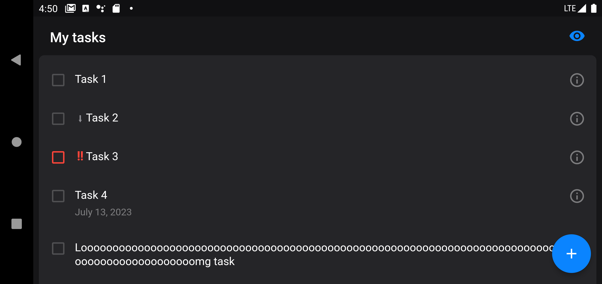                       | 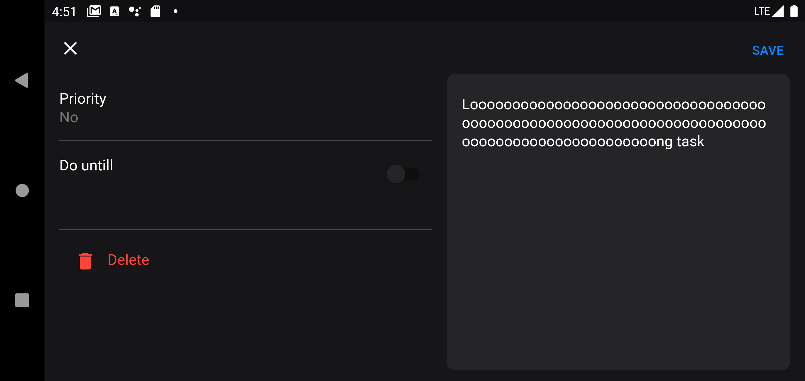 |         |

- `Remote Config` работает, но через hot restart.
- `Крашлитика` подключена, ошибки отправляет.

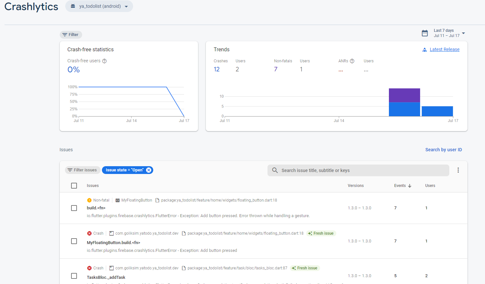

- `2 флейвора` поддержаны (dev/prod). Отличаются названием, иконкой и наличием шильдика dev.
- Добавлен сбор `аналитики` по событиям. Делал в последний момент, так что в ивентах пока не видно (24 часа не прошло), могу показать из debugView.

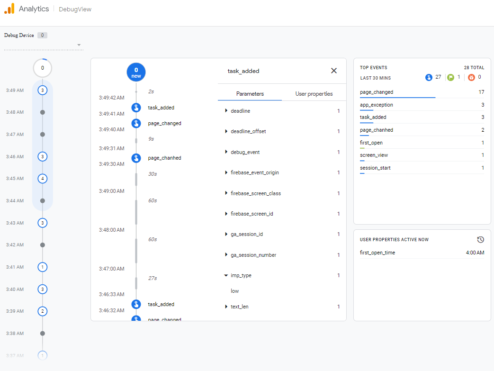

- Инвайт код на Firebase `App Distribution` -> https://appdistribution.firebase.dev/i/0803458404047ead

- Перевел модельку таски на  `freezed`. Состыковать freezed_annotation и hive_annotation та еще задачка 🤯.

  </details>

## **Homework 4.2** Created by goliksim on 19.07.2023

<details>
<summary><b>Посмотреть описание</b> </summary>
<br/>

**APK** -> https://drive.google.com/file/d/1vz6fFl8yaO98TdlnHUFOJu3vEmGq0NZX/view?usp=sharing
Инвайт код на Firebase `App Distribution` -> https://appdistribution.firebase.dev/i/0803458404047ead

**Список изменений:**

- Теперь `RemoteConfig` обновляется в `Runtime`
- Обновил **flutter** и вытекающие, так как у проверяющих были сложности.
- Починил `Dissmisible`, теперь иконки ездят по фигме.
- Добавил `navigatorObserver` и перенес аналитику страниц в него.
- Перевел `bloc` классы на **freezed**
- Небольшие доработки

  </details>
