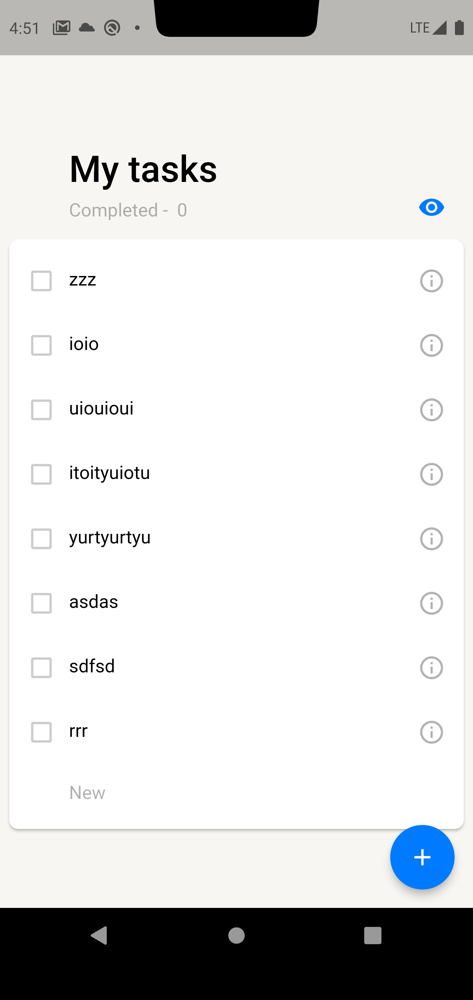
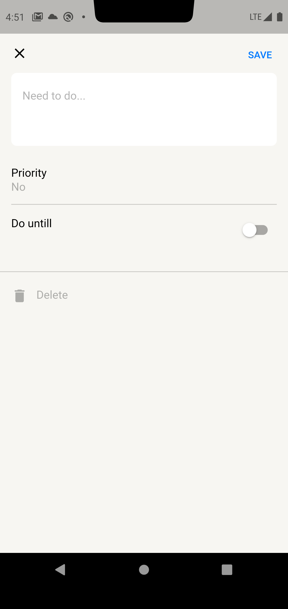

# ya_todolist (NDA)

## **Homework1** Created by goliksim on 15.06.2023 

<b>Посмотреть описание</b> 

Привет!  
Вообще хочу сказать, что я не очень опытен в разработке. Имеется всего 1 соло проектик.

- Проект построен на StateFul / StateLess виджетах с прокидыванием переменных, также поэкспериментировал с InheritedWidgets.
- Навигация самая элементарная (push, pop), но с прокидыванием результата работы редактора.
- Для аппбара использовал визжет SliverAppBar, сделал для него небольшую анимашку с прозрачностью.
- Ячейки с тасками построены через SliverList.
- Форматирование кода выполнил через Dart format.
- Оба экрана сверстаны.
- Новые таски добавляются.
- Таски удаляются обоими способами.
- Таски выполняются и скрываются, подсчет выполненных тасков рабочий.
- Таски редактируются.
- Важность ставиться, меняется и отображается.
- Дата дедлайна выбирается, отключается и отображается (уведомлений нет).
- Свайпы рабочие
- Реализовано сохранение в Shared-Preferences(Подобие persistance), а также пишу логи в локальное хранилище.
- Поработал над хранением темы приложения

| Темная тема                    | Редактор                               |Менюшка                                 |
| ------------------------------ | -------------------------------------- |--------------------------------------- |
|  |  |  |

###  Для справки
---

При подходе к проектированию пытался заложить зачатки чистой архитектуры Роберта Мартина (построение приложения в виде набора независимых слоёв).  
В качестве решения для управления состоянием приложения (State Managment) хотел выбрать BLOC, но пока до него не дошел. 

## **Homework2** Created by goliksim on 24.06.2023 

<b>Посмотреть описание</b> 

 

**APK** -> https://drive.google.com/file/d/1Mki9lmu15i3C2CkzLjOkisNC1vTDFJ2D/view?usp=drive_link

**Список изменений:**
- Добавил ссылку на apk в README
- Предупреждений `flutter lints` не выдает.
- Постарался все отформатировать.
- Полностью переписан стейтменеджмент, теперь это `bloc`.
- В коде два блока с taskList'ом и окном редактирования. Bloc to bloc коммуникации через стримы нет, но друг с другом я их связал.
- Кое-как реализовал работу с бекэндом. На данный момент при запуске приложения смотриться revision версия локального хранилища и бекенда. Где выше версия, то и гружу. Все действия сохраняю автоматически и там, и там. 
- Персистентность уже была, но немного модифицировалась под связь с беком. Использую `shared_preferences`.
- Исправлены мелкие баги
- Добавлена `интернализация`.

| <pre>Английский язык 1</pre> | <pre>Английский язык 2</pre>  | <pre>Пруфы с бэкенда                                                                                                                                                                                                                                                        </pre>|
| ------------------| ------------------ |--------------------------------------------------- |
|  |  |  |

