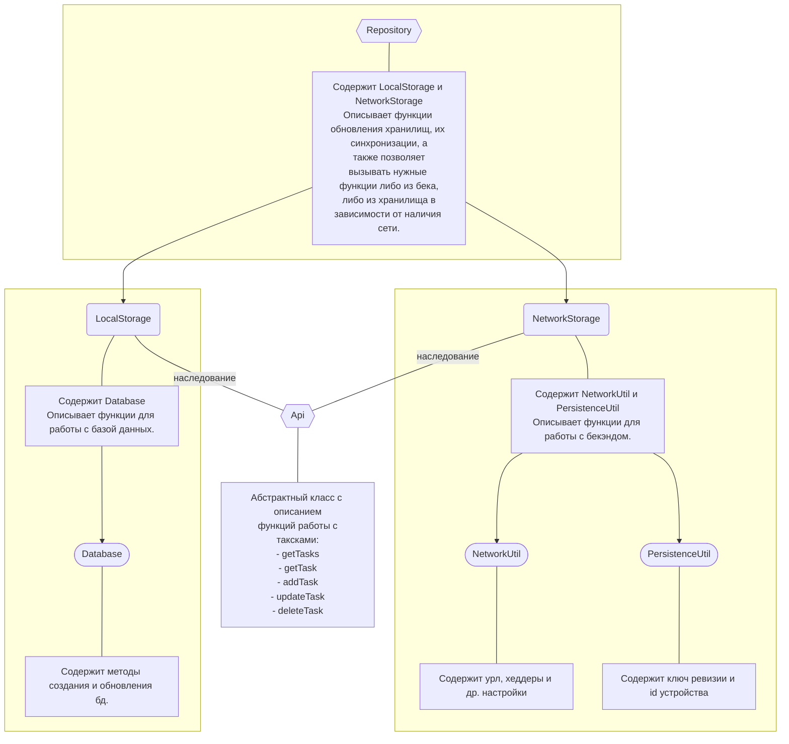

# ToDoList Architecture

```mermaid
flowchart TD
	subgraph   
	Rep{{Repository}} --- Rep_dis[Содержит LocalStorage и NetworkStorage\nОписывает функции обновления хранилищ, их синхронизации, а\n также позволяет вызывать нужные функции либо из бека,\n либо из хранилища в зависимости от наличия сети.] ; 
	end;
	Rep_dis --> LS(LocalStorage) & NS(NetworkStorage);
	
	LS & NS ---| наследование | Api{{Api}} ;
	Api --- Api_dis[Абстрактный класс с описанием\n функций работы с таксками:\n- getTasks\n- getTask\n- addTask\n- updateTask\n- deleteTask] ;
	
	subgraph  
	NS --- NS_dis[Содержит NetworkUtil и PersistenceUtil\nОписывает функции для работы с бекэндом.];
	NS_dis --> NU([NetworkUtil]) & PU([PersistenceUtil]);
	NU --- NU_dis[Cодержит урл, хеддеры и др. настройки];
	PU --- PU_dis[Содержит ключ ревизии и id устройства];
	end;
	
	subgraph  
	LS --- LS_dis[Содержит Database\nОписывает функции для работы с базой данных.];
	LS_dis --> BD([Database]);
	BD --- BD_dis[Cодержит методы создания и обновления бд.];
	end;
    
	
```