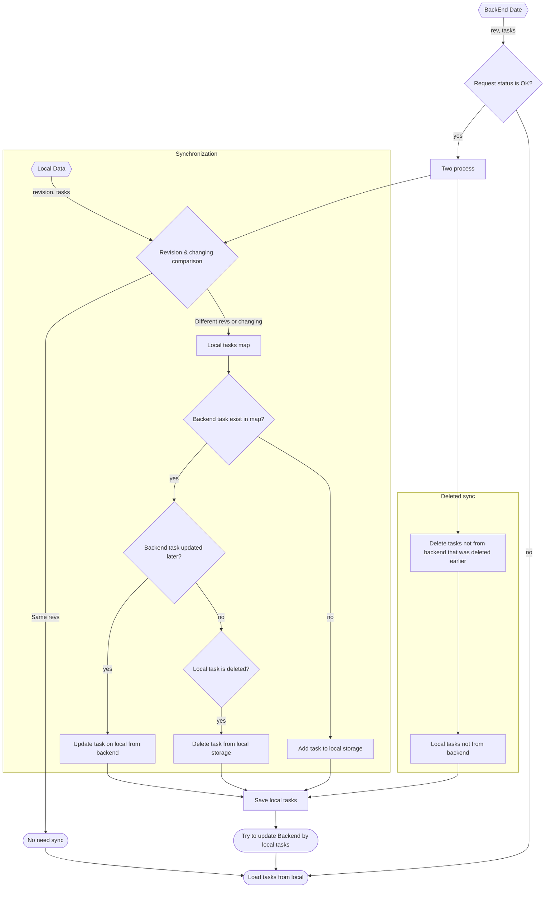

# Sync Architecture

```mermaid
flowchart TD
	Back{{BackEnd Date}} -- rev, tasks -->  Req{Request status is OK?};
	

	Rev -- Same revs --> NoNeed([No need sync])
	
	Back 
	Req -- yes -->  ReqYes[Two process]
	ReqYes --> Rev
	Req -- no -->  LocLoad([Load tasks from local])
	Loc{{Local Data}};
	
	
 	
	subgraph "Synchronization"
	Loc -- revision, tasks --> Rev{Revision & changing comparison};	
	Rev -- Different revs or changing --> Map[Local tasks map]	
	Map --> Exs{Backend task exist in map?}
	
	Exs -- yes --> IsUpd{Backend task updated later?}
		 
	IsUpd -- yes --> Upd[Update task on local from backend]
	IsUpd -- no --> IsDel{Local task is deleted?}
	IsDel -- yes --> Del[Delete task from local storage]
	Exs -- no --> Add[Add task to local storage]
	end;
	
	

	ReqYes --> DelLoc[Delete tasks not from backend that was deleted earlier];
	
	subgraph Deleted sync
	DelLoc ---> DelOth;
	end;
    
	Del & Upd & Add & DelOth[Local tasks not from backend] --> Save[Save local tasks]
	
	
	Save --> End([Try to update Backend by local tasks])
	End --> LocLoad
	NoNeed --> LocLoad


    
	
```